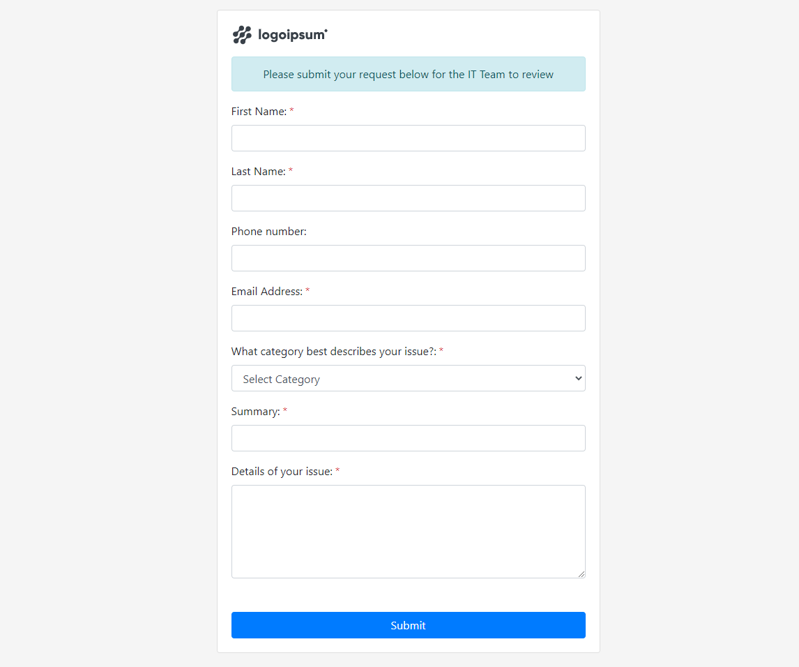

# Asp.Net Core 3.1 Simple MVC form submission example
This is a simple example of an asp.net core 3.1 form submission that saves data using entity framework core.
To get started restore the nuget packages open the package manager console and run `update-database`. 
